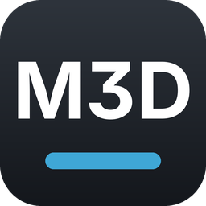
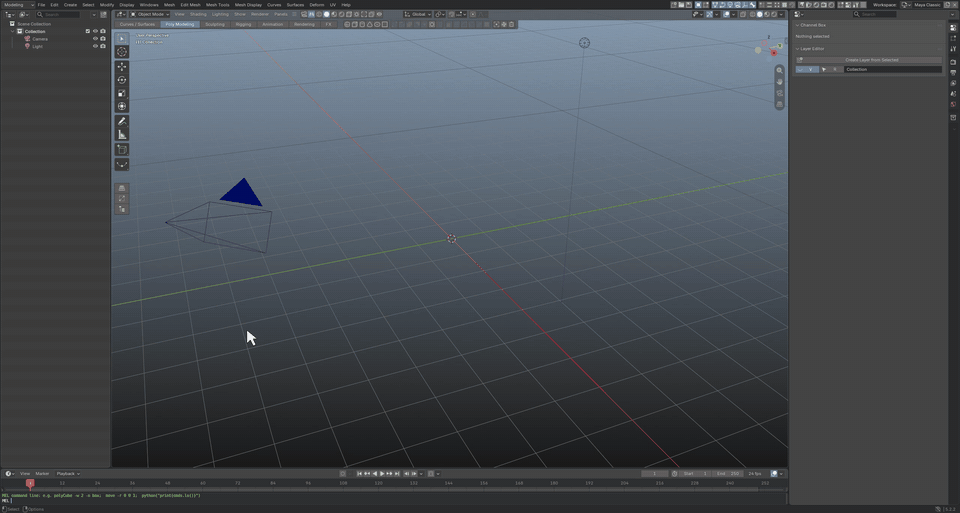
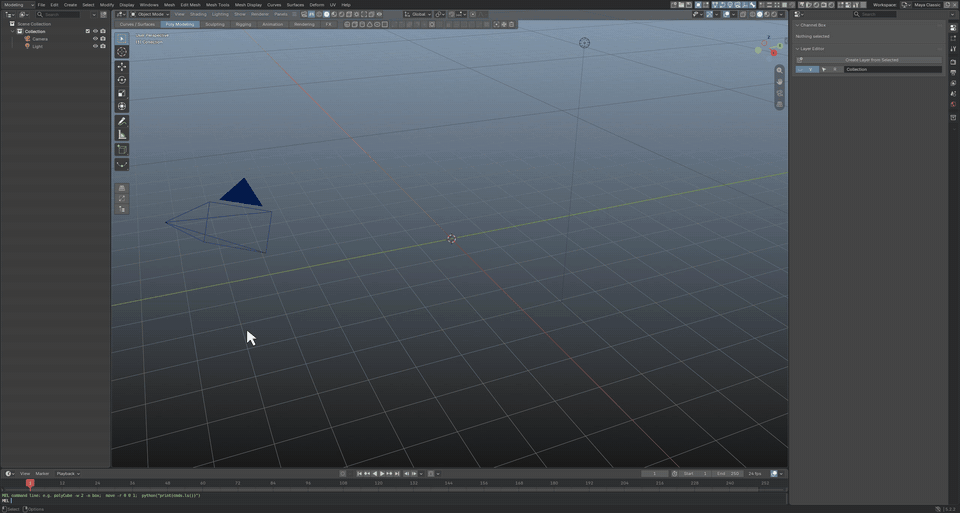
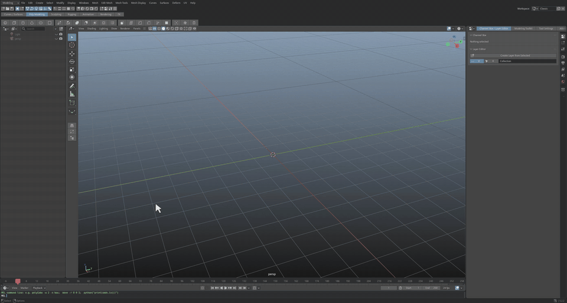
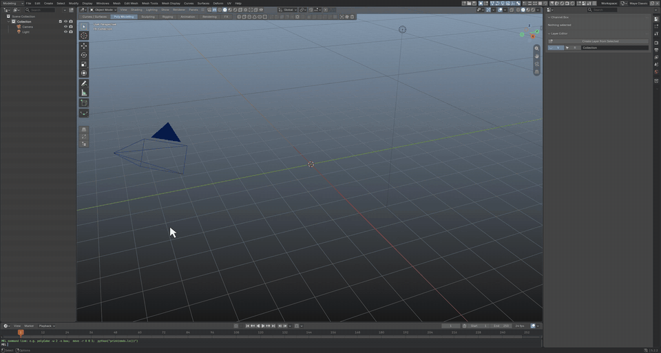
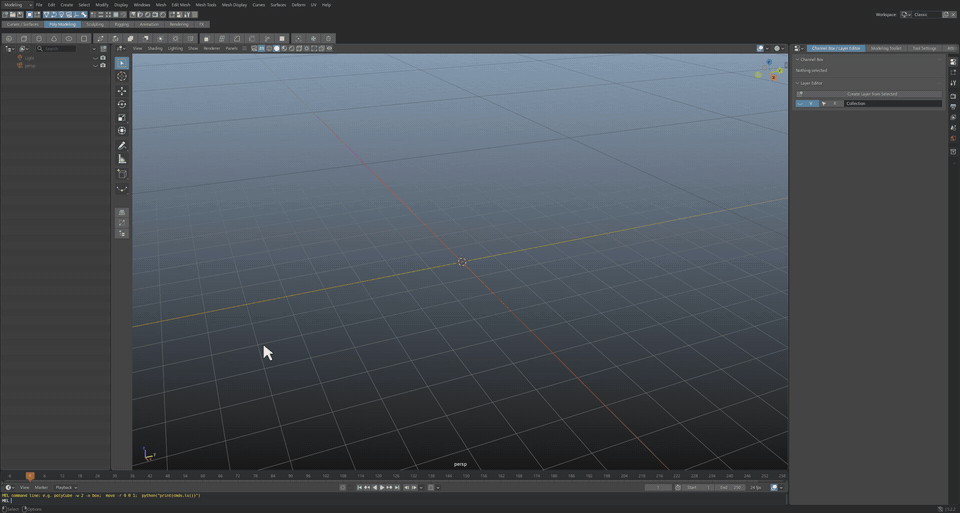
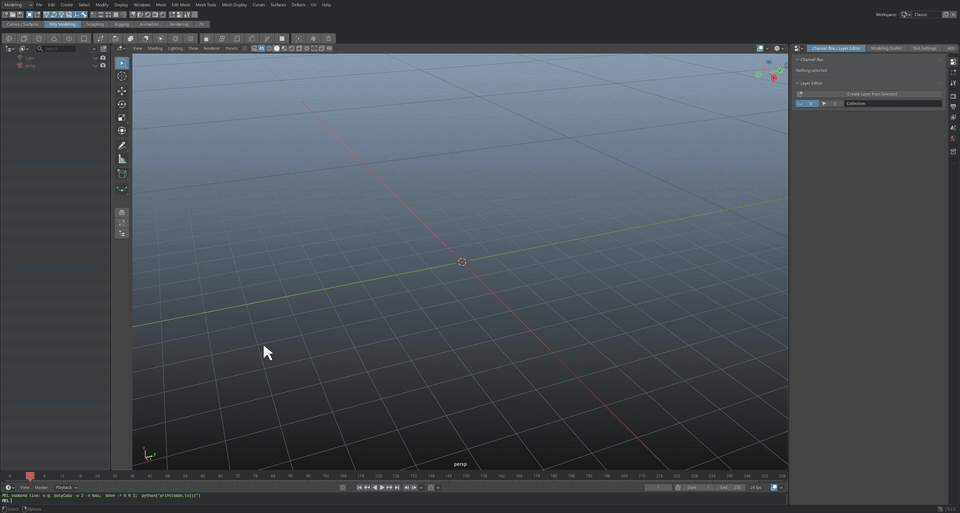

# Maelstrom3D



**A 3D creation suite based on Blender 5.2, with a classic studio workflow:** menu sets, a Status Line and shelves
across the top, a Channel Box dock, marking menus, a Modeling Toolkit, a UV Toolkit and a MEL command line.
Artists who learned on Autodesk® Maya® will find the hotkeys and layout familiar.

Maelstrom3D is a fork of [Blender](https://www.blender.org) (branch `maelstrom3d`, based on the `v5.2.2` LTS
release). Everything is set up out of the box.

**Download (Windows x64):** see [Releases](../../releases). Unzip and run `Maelstrom3D.exe`.

| | |
|---|---|
|  |  |
| **Interface:** Classic layout, menu sets (F2-F6), shelf tabs, Space for four view. [MP4](docs/media/interface.mp4) | **Modeling:** Shift+drag the manipulator to extrude, right-click for every tool on the selected faces, 1/2/3 smooth preview. [MP4](docs/media/modeling.mp4) |
|  |  |
| **Marking menus:** W + left click, Shift / Ctrl+Shift right-click, Space hotbox. [MP4](docs/media/marking_menus.mp4) | **Right-hand dock:** Channel Box / Layer Editor, Attribute Editor (Ctrl+A), Modeling Toolkit. [MP4](docs/media/dock.mp4) |
|  |  |
| **UV editing:** F12, UV Toolkit, Automatic / Layout, checker map. [MP4](docs/media/uv.mp4) | **MEL command line:** `polyCube -w 3 -n floor;`, plus `cmds` in Python. [MP4](docs/media/mel.mp4) |

## What you get

- **Interface:** menu bar with menu sets (Modeling, Rigging, Animation, FX, Rendering), Status Line, shelf tabs and
  shelf as rows across the top; viewport panel menus and toolbar, camera name and axis HUD; Quick Layout buttons;
  Outliner on the left; Time Slider; MEL / Python command line; Classic, Modeling, Sculpting, UV Editing, Rigging,
  Animation and Rendering workspaces.
- **Right-hand dock:** Channel Box / Layer Editor, Modeling Toolkit, Tool Settings and the Attribute Editor.
- **Hotkeys:** QWERT, Alt+mouse tumble / track / dolly, F / A framing, F8-F12, 1-7, D pivot, Ctrl+D / Shift+D,
  Ctrl+G, P, X / C / V snapping, Z undo, G repeat, [ ] view undo, pickwalk, Ctrl+A, Space hotbox and more.
- **Marking menus:** right-click, Shift / Ctrl / Ctrl+Shift right-click, Q / W / E / R / A / H + left click,
  Shift+S keys and tangents.
- **Look:** mid-grey UI with a blue highlight, gradient viewport, green / white selection, square widgets.
- **UV workflow:** UV Toolkit, Cut / Sew / Unfold / Layout, checker map, UV marking menus.
- **Scripting:** `m3d.cmds` (`polyCube`, `move`, `setAttr`, `select`, `ls`, ...) and MEL in the command line.
  Existing scripts that `import maya.cmds` run through a compatibility alias.

Guides:
- [MAELSTROM3D.md](MAELSTROM3D.md): full guide and change log.
- [SHORTCUTS.md](SHORTCUTS.md): every changed shortcut, before and after.
- [PARITY.md](PARITY.md): feature-by-feature comparison and what's still missing.

## Build from source (Windows)

Needs Visual Studio 2022 or 2026 with C++, CMake and Git LFS (Blender's
[build guide](https://developer.blender.org/docs/handbook/building_blender/windows/)).

```
git clone -b maelstrom3d https://github.com/LiamLacey95/Maelstrom3D.git
cd Maelstrom3D
git -c submodule."lib/windows_x64".update=checkout submodule update --init --depth 1 lib/windows_x64
make.bat 2026
```

Large files come from Blender's own LFS server (see `.lfsconfig`). Self-checks:
`blender -b --factory-startup --python-exit-code 1 --python tools/m3d/test_m3d.py`.

## Credits, license, trademarks

Maelstrom3D is a modified version of Blender by the Blender Foundation and contributors, released under the
GNU GPL v2 or later like Blender itself (see [COPYING](COPYING) and [doc/license](doc/license)). The full source
for every release is this repository. The Maelstrom3D icon and splash are original artwork.

Maelstrom3D is an independent project and is not affiliated with, endorsed by or sponsored by Autodesk, Inc. or the
Blender Foundation. Autodesk and Maya are registered trademarks of Autodesk, Inc. Blender is a registered trademark
of the Blender Foundation. These names appear only to describe compatibility.

Blender's original read-me: [README.blender.md](README.blender.md).
