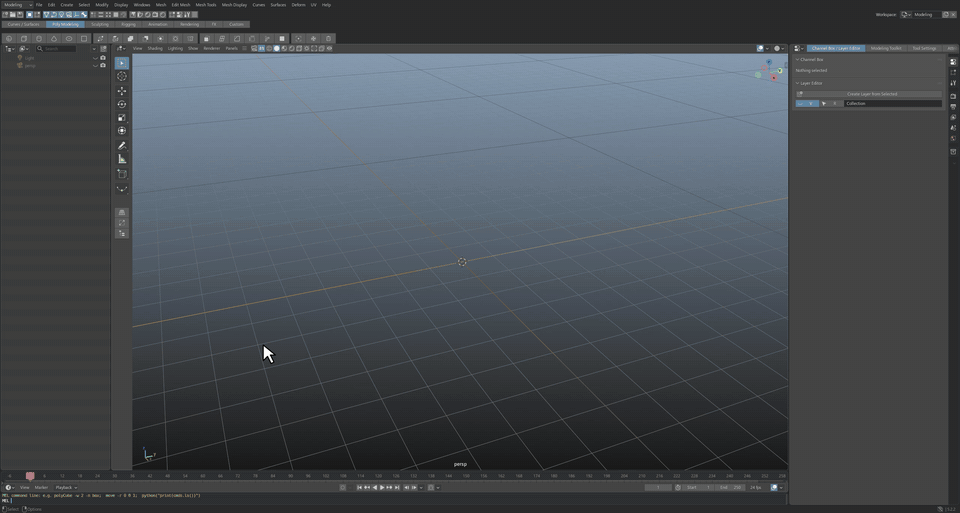
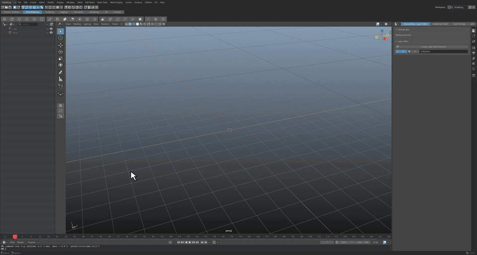
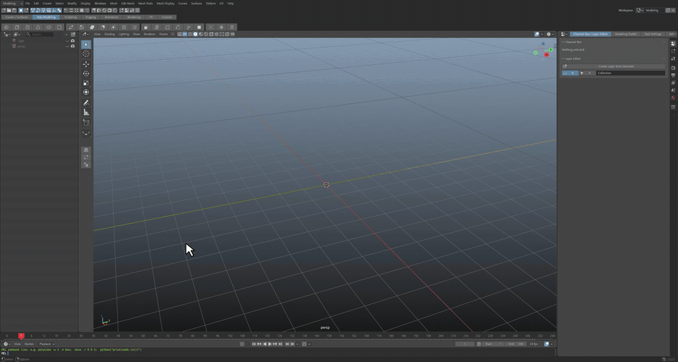
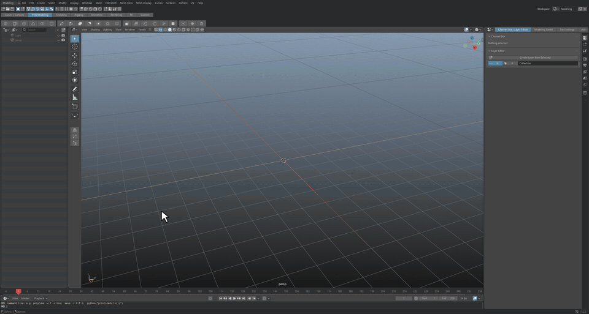

# Maelstrom3D


**A 3D creation suite based on Blender 5.2, with a classic studio workflow:** menu sets, a Status Line and shelves
across the top, a Channel Box dock, marking menus, a Modeling Toolkit, a UV workspace and a MEL command line.
Artists who learned on Autodesk® Maya® will find the hotkeys and layout familiar.

Maelstrom3D is a fork of [Blender](https://www.blender.org) (branch `maelstrom3d`, based on the `v5.2.2` LTS
release). Everything is set up out of the box.

**Download (Windows x64)** from [Releases](../../releases):
- **Installer** (`...-setup.exe`): installs for your user (no admin needed), adds a Start menu entry and an uninstaller.
- **Portable** (`...-portable.zip`): unzip anywhere (a USB stick works) and run `Maelstrom3D.exe`; settings stay in its
  `portable` folder.

Maelstrom3D keeps its settings apart from Blender's (`%APPDATA%\Maelstrom3D`), so both can be installed side by side.

| | |
|---|---|
|  |  |
| **Interface:** Seven task workspaces on F1-F7 with their menu sets, Add to Shelf (right-click any button) for the Custom shelf, Space for four view. [MP4](docs/media/interface.mp4) | **Modeling:** Shelf cube, Shift+drag the manipulator to extrude, right-click for every tool on the selected faces, toolkit tools open an options box on the click, 1/2/3 smooth preview. [MP4](docs/media/modeling.mp4) |
|  |  |
| **Sculpt:** F2: brush tray, Clay Strips with mirror, Smooth, Grab (Shift+4), mask and invert, Voxel Remesh, Multires, Face Sets. [MP4](docs/media/sculpt.mp4) | **UV editing:** F3: Auto Unwrap, Cut / Unfold / Layout, checker map, distortion, texel density Read and Set. [MP4](docs/media/uv.mp4) |
|  |  |
| **Texture:** F4: paint channels, strokes on Base Color, paint and fill layers with a mask, blend mode, Bake, Export. [MP4](docs/media/texture.mp4) | **Rigging:** F5: Joint tool, X-Mirror chains, Orient Joint, Bind, weight paint view, IK with Pole, control shapes, Drive tab. [MP4](docs/media/rigging.mp4) |
|  |  |
| **Animation:** F6: keys with S, Graph Editor / Dope Sheet toggle, Alt+Q tween, motion paths, Blocking / Polish, Playback. [MP4](docs/media/animation.mp4) | **Rendering:** F7: quality presets, camera from view, light table, HDRI Sky, IPR, Shift+F12 into the Render View. [MP4](docs/media/rendering.mp4) |
|  |  |
| **Marking menus:** W + left click, Shift / Ctrl+Shift right-click, Space hotbox. [MP4](docs/media/marking_menus.mp4) | **Right-hand dock:** Channel Box / Layer Editor, Attribute Editor (Ctrl+A), Modeling Toolkit, the tab menu. [MP4](docs/media/dock.mp4) |
|  | |
| **MEL command line:** `polyCube -w 3 -n floor;`, plus `cmds` in Python. [MP4](docs/media/mel.mp4) | |

## What you get

- **Interface:** menu bar with menu sets (Modeling, Sculpting, UV, Texturing, Rigging, Animation, FX, Rendering), Status Line, shelf tabs and
  shelf as rows across the top; viewport panel menus and toolbar, camera name and axis HUD; Quick Layout buttons;
  Outliner on the left; Time Slider; MEL / Python command line; Modeling, Sculpt, UV, Texture, Rigging,
  Animation and Rendering workspaces on F1-F7.
- **Right-hand dock:** Channel Box / Layer Editor, Modeling Toolkit, Tool Settings and the Attribute Editor.
  Modeling Toolkit tools (Bevel, Extrude, Connect, ...) apply on the click and open an options box beside it.
- **Hotkeys:** QWERT, Alt+mouse tumble / track / dolly, F / A framing, F8-F12, 1-7, D pivot, Ctrl+D / Shift+D,
  Ctrl+G, P, X / C / V snapping, Z undo, G repeat, [ ] view undo, pickwalk, Ctrl+A, Space hotbox and more.
- **Marking menus:** right-click, Shift / Ctrl / Ctrl+Shift right-click, Q / W / E / R / A / H + left click,
  Shift+S keys and tangents.
- **Look:** mid-grey UI with a blue highlight, gradient viewport, green / white selection, square widgets.
- **Sculpt workflow (F2):** brush tray, Multires / Voxel Remesh / QuadriFlow / Dyntopo, mask and face set tools, mesh filters,
  color paint, display options and a mesh list, Shift+1-7 brush keys.
- **UV workflow (F3):** UV Editor and 3D view with a dock of Unwrap, Arrange, Check, Create and UDIM tabs, Cut / Sew / Unfold /
  Optimize / Layout, Auto Unwrap, texel density read / set / match, distortion and checker map, UV marking menus.
- **Texture workflow (F4):** 3D view and paint view with a brush tray, paint channels (Base Color, Roughness, Metallic, Normal,
  Height, Emission), a paint layer stack (Paint and Fill layers, masks, blend modes, Merge Down, Flatten), Bake (Normal, AO,
  Curvature, Position, Thickness), Export (glTF, Unreal ORM, Unity; layers are flattened), HDRI and channel view, painted
  images saved with the file, C / Shift+C channel keys.
- **Rigging workflow (F5):** Outliner with the bone hierarchy, a large viewport and a dock of Skeleton, Controls & Constraints, Skin,
  Drive, Test and Collections tabs that follows the mode; Joint tool, Orient Joint, control shapes with colors, IK with pole,
  bind with envelope fall back, weight tools (flood, smooth, normalize, limit, clean, mirror, transfer, weight table), Driven Key,
  naming check, pose library, Rigify on demand; Ctrl+E extrude bone, Shift+N naming menu.
- **Animation workflow (F6):** large viewport plus a camera view, one bottom editor that switches between Graph Editor and Dope Sheet
  with a Timeline under it, a dock of Channel Box (the active bone's channels in Pose Mode), Pick (selection sets, bone collections),
  Tween & Poses, Motion (motion paths, ghost curves), Layers (NLA) and Playback; Auto Key, key type, new key interpolation,
  Blocking / Polish presets, Tween slider and Alt+Q, Push / Relax / Breakdown keys, object selection sets, Playblast.
- **Rendering workflow (F7):** a 3D view next to a Render View, a dock of Camera, Lighting, Materials, Render, Output,
  Passes & Layers and Advanced tabs; Draft / Medium / Final quality presets for Cycles and EEVEE, a light table (power, color,
  shadows, visibility), HDRI sky that keeps your world, camera from view, IPR, Shift+F12 render.
- **Scripting:** `m3d.cmds` (`polyCube`, `move`, `setAttr`, `select`, `ls`, ...) and MEL in the command line.
  Existing scripts that `import maya.cmds` run through a compatibility alias.

Guides:
- [MAELSTROM3D.md](MAELSTROM3D.md): full guide and change log.
- [SHORTCUTS.md](SHORTCUTS.md): every changed shortcut, before and after.

## Build from source (Windows)

Needs Visual Studio 2022 or 2026 with C++, CMake and Git LFS (Blender's
[build guide](https://developer.blender.org/docs/handbook/building_blender/windows/)).

```
git clone -b maelstrom3d https://github.com/LiamLacey95/Maelstrom3D.git
cd Maelstrom3D
git -c submodule."lib/windows_x64".update=checkout submodule update --init --depth 1 lib/windows_x64
make.bat 2026
```

Large files come from Blender's own LFS server (see `.lfsconfig`). Self-checks:
`blender -b --factory-startup --python-exit-code 1 --python tools/m3d/test_m3d.py`.

## Credits, license, trademarks

Maelstrom3D is a modified version of Blender by the Blender Foundation and contributors, released under the
GNU GPL v2 or later like Blender itself (see [COPYING](COPYING) and [doc/license](doc/license)). The full source
for every release is this repository. The Maelstrom3D icon and splash are original artwork.

Maelstrom3D is an independent project and is not affiliated with, endorsed by or sponsored by Autodesk, Inc. or the
Blender Foundation. Autodesk and Maya are registered trademarks of Autodesk, Inc. Blender is a registered trademark
of the Blender Foundation. These names appear only to describe compatibility.

Blender's original read-me: [README.blender.md](README.blender.md).
